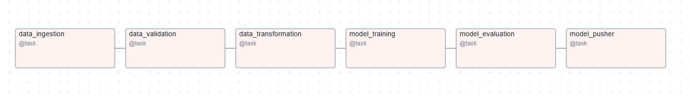
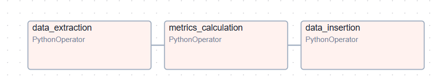
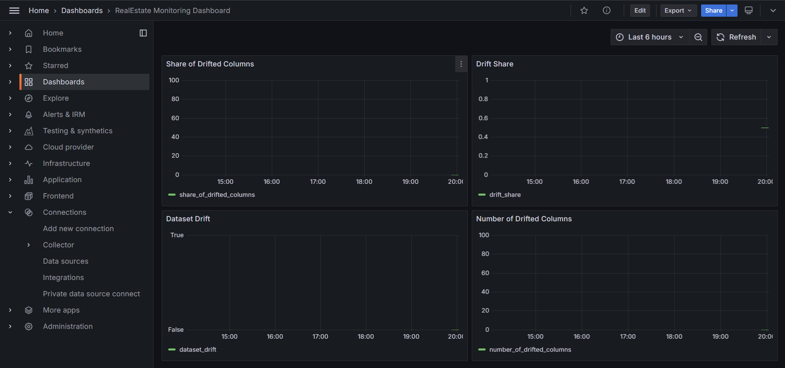

# RentPricePrediction

This project is a continuation of the Real Estate Data Engineering project, where data was collected from commonfloor website. In this phase, the focus shifts to building a machine learning solution for predicting house rents based on the gathered data.

The project includes:

1. End-to-end automation of the ML pipeline, from data ingestion to deployment.
2. Advanced tracking of model experiments and versions using MLflow.
3. Deployment of the final model to AWS.
4. Integration of monitoring tools like Grafana to ensure system reliability and detect data drift in real time.

# Project Overview

1. End-to-End Machine Learning Pipeline: Covers every stage from data ingestion to model pushing, fully automated with Airflow.
2. Experimentation Tracking: Utilized MLflow for tracking experiments, logging model metrics, and managing model versions.
3. Model Deployment: The final trained model is pushed to AWS for production use.
4. Data Storage: Data is stored in MongoDB, ensuring scalability and quick access.
5. Data Drift Monitoring Dashboard: Developed using Grafana, with data stored in AWS PostgreSQL, to track any anomalies in incoming data and monitor the system's performance.
6. Airflow Pipelines:
    1. Retraining Pipeline: Automatically retrains the model when new data is available.
    2. Monitoring Pipeline: Dumps monitoring data into PostgreSQL for analysis.


# Technology Stack

1. Languages: Python
2. Machine Learning Tools: Pandas, Numpy, Scikit-Learn,MLflow 
3. Workflow Orchestration: Apache Airflow
4. Database: MongoDB for raw/processed data, AWS PostgreSQL for monitoring
5. Dashboard: Grafana for data drift and system monitoring
6. Cloud Services: AWS for model storage and monitoring database

## Pre-requisites

Essential Folders:

1. logs/: For storing Airflow logs.
2. plugins/: For any Airflow plugins.
3. config/: For storing configuration files needed by Airflow.
4. Docker: Ensure these are installed to run Airflow.
5. Docker Service Naming: Avoid using underscores (_) in Docker service names, as they may cause issues with Airflow connections.
6. MongoDB: Set up MongoDB for data storage.
7. AWS Account: To push final model and monitoring data dump 
8. Grafana Account: To monitor the data drift





## Running the Pipeline

1. Create .env Files:
Two .env files are required:

.env inside the src folder
This file contains sensitive credentials for data processing, model registry, and cloud storage.

Contents of src/.env:

```
connection_string=''
database_name=''
collection_name=''
repo_owner=''
repo_name=''
aws_access_key_id=''
aws_secret_access_key=''
region=''
bucket_name='' 
```

.env inside the dags folder
This file contains credentials for monitoring and dumping data into PostgreSQL and other related configurations.

Contents of dags/.env:

```
host=""
database=""
user=""
password=""
connection_string=''
```


2. Build Docker Containers (First-Time Setup Only):

```
docker-compose build
```

3. Start the Services:

```
docker-compose up -d
```

4. Access the Airflow Web UI:

Once the services are running, access the Airflow UI to monitor and trigger the DAGs.

Default URL: http://localhost:8080

In the Airflow UI, Two pipeline will be present. One is ML retraining pipeline and other is monitoring pipeline.
Stop the Services (When Done):

```
docker-compose down
```

5. Rebuild (If Necessary):

If you make changes to the Docker configuration, rebuild the containers:

```
docker-compose build
```